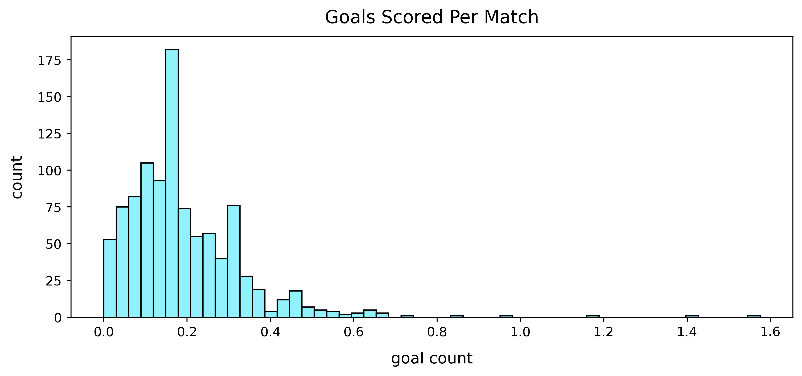
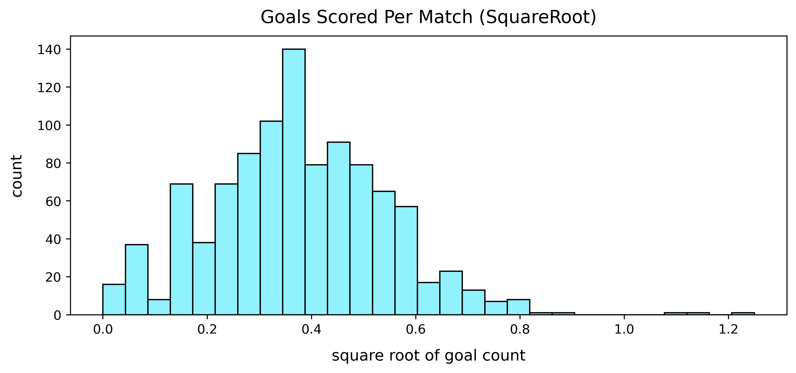
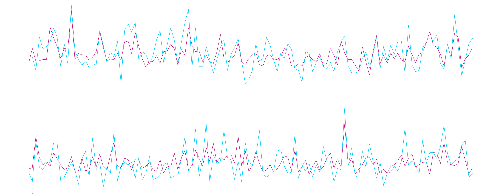

# Using Machine Learning to Predict Footballer Performance
**Dustin Stewart**   
May 3, 2021

Photo by <a href="https://unsplash.com/@danielnorin?utm_source=unsplash&utm_medium=referral&utm_content=creditCopyText">Daniel Norin</a> on <a href="https://unsplash.com/s/photos/football?utm_source=unsplash&utm_medium=referral&utm_content=creditCopyText">Unsplash</a>
  

### Predicting an Unpredictable Sport
---
Football is a notoriously hard sport to predict. Player performance reflects that. Some of the greatest strikers on earth can't score for 10 matches in a row. Then they'll score a hattrick in the next match. In this project, I will develop a machine learning model that can more accurately predict future player performance by using aggregated historical player data. 

### Summary
#### Background
---
#### A Record Breaking Flop of a Player
In late 2015 a 23 year old footballer sat watching his career crumbling. He had played 20 matches for his English Premier League club and only scored 3 goals. Quite frankly, he had not made the cut and was set to be sold by the club. Despite his deep faith in himself, even he must have thought his career was on a tragic downhill slide. There's absolutely no way that he was thinking that in three years he would return to the premier league and break Cristiano Ronaldo's record of 31 goals in a season. But nonetheless he did. The player's name was Mohamed Salah, now an EPL and European Champion valued at 121 million dollars. This story is at the heart of why football is the world's most popular sport. The underdogs always have a chance. 

Unfortunately, that's also why the sport is such a risky endeavour to invest money in. More often than not, players do not meet the expectations of their transfer fees. After all is said and done a 100 million dollar player could provide 12 goals over three years. That's 8.4 million dollars per goal! Because of this, football owners have increasingly looked to use data to make better investments. Notable clubs to have done this somewhat succesfully are Borussia Dortmund in Dortmund, Germany and Liverpool FC in Liverpool, England. 

**Because of how difficult it is to predict a player's future performance by using traditional methods, the purpose of this project is to develop a machine learning model that can better predict a young player's future performance.** 

This machine learning model is useful for any football club looking to more reliably hedge their bets on players. This, in tandem with traditional scouting can help clubs acquire talent while limiting risk. 

### Table of Contents
---
- [Acquisition](code/01_Data_Acquisition.ipynb)
- [Cleaning](code/02_Data_Cleaning.ipynb)
- [Analysis](code/03_Data_Analysis.ipynb)
- [Modeling and Predictions](code/04_Modeling.ipynb) 
- [Presentation Given May 3, 2021](https://docs.google.com/presentation/d/1Lz9qD276Hrsx5jv89bRAUBYB4ozsAU9BgibDaD4cFrU/edit?usp=sharing) 

### Data
---

- A [*Dataset*](https://www.kaggle.com/prasadvpatil/mrl-dataset) taken from [whoscored.com](https://www.whoscored.com/) which collects data from opta. I used the [Selenium WebDriver API](https://selenium-python.readthedocs.io/) and [Beautiful Soup](https://www.crummy.com/software/BeautifulSoup/bs4/doc/) to gather data from the site for analysis. 
- The dataset contains around 700 players who played at least four consecutive seasons in europe while under 29 years old and with at least 7 appearances each season.
- All categories were taken as a "per match" ratio in order to discount appearance number.
##### Feature Engineering
* Used interaction features as well as modified features
* The squareroot of goals was used  

###### 

  
(Photo by Kelly Lacy from Pexels)  

### Modeling
---
* 4 consecutive years of data were used in each data row.
* First two years are used to predict an aggregated total of the last two years goals, assists, and key pass total. Referred to in the data as "G&A&KP" 
  
**Metric:** Root Mean Squared Error (RMSE)
* A baseline score was established as 0.67 RMSE
* Used Random Forest, KNN, and linear regression models.
* L2 regularization was consistently the best.
* Eventually ended up with a cross-validated 0.44 RMSE score. Most of the predictions were good, but there were some outliers that were impossible to predict without lowering the overall test score. 
# 

### Overall Conclusions
---
* There is an element of football that will always make it unpredictable. Mohamed Salah, Mario Balotelli, and countless others' career trajectories could not have been calculated mathematically.
* While machine learning does not eliminate the risk in player performance predictions, it can significantly reduce it. 
* When used in conjunction with subjective player analysis, this model could help make better decisions at football clubs.
##### 
[Presentation on Findings](https://docs.google.com/presentation/d/1Lz9qD276Hrsx5jv89bRAUBYB4ozsAU9BgibDaD4cFrU/edit?usp=sharing)

### Areas for Further Research
---
* More data. Computer vision provides access to millions of data points per match. This data is very heavily guarded for good reason, but getting into the minute aspects of a player's game, something that's not understandable by the human mind, is the only way to truly beat the human mind (football scouts). 
* Integrate performance based on destination league. This would also need better data though as the amount of players who go from ligue 1 to the premier league for example is 10-20 per season.  

### Acknowledgements:

Special thank you to [José Ramón Arias González](https://github.com/joseramon-arias/scraper-whoscored). While the code I used was significantly different from his, he inspired my technique for gathering data from whoscored. Thank you. 
