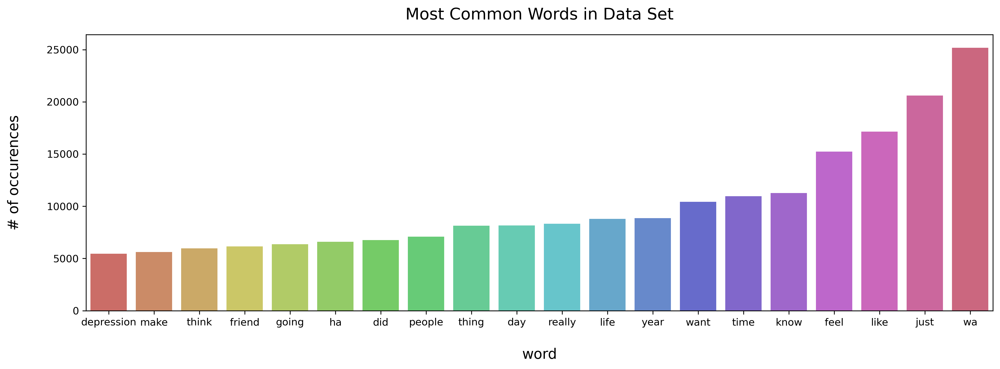
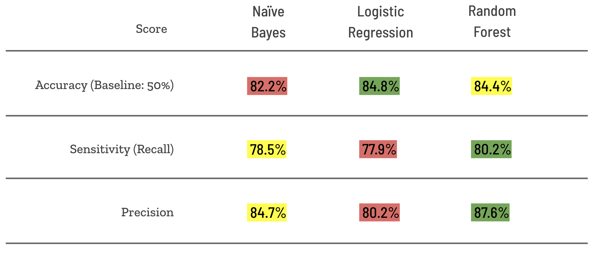

# Using Machine Learning & Reddit to Predict Mental Health Disorders
By **Dustin Stewart**
### Summary

**Problem**  
Mental health disorders are difficult to predict. Can using Reddit, NLP, and machine learning make better predictions than the options currently available?

**Background**  
Misdiagnosis of Bipolar disorder is widespread. In a study from 1999, it was discovered that 40% of bipolar patients had been misdiagnosed in the past, most with major depression. Misdiagnoses are also not caught for long periods of time. A survey done in Europe on 1000 people with bipolar disorder found that on average it took 5.7 years to correct a misdiagnosis. The consequences can be severe as Tanvir Singh (MD) and Muhammad Rajput (MD) write:

> An incorrect diagnosis of unipolar depression carries the risk of inappropriate treatment with antidepressants, which can result in manic episodes and trigger rapid cycling. Delay in start of mood stabilizers in bipolar disorder patients has been associated with increased healthcare costs, which include increased suicide attempts and higher rates of hospital use. - [Psychiatry MMC](https://www.ncbi.nlm.nih.gov/pmc/articles/PMC2945875/)

The consequences can be severe. The current non-human diagnosis standard is the Mood Disorder Questionnaire, which when evaluated in the American Journal of Psychology in 2000, produced a sensitivity(recall) score of 73%, which means there are still 27% of people who are bipolar and not properly diagnosed by this questionnaire.

**Objective:**   
This project intends to create a model that will correctly classify depression and bipolar posts on Reddit and provide insight for real world applications of mental health diagnostics. We will be looking at overall accuracy of predictions as well as sensitivity rate, which reflects the percentage of bipolar posts that were correctly predicted. 

### Data
**Size of data set**  
10,000 posts pulled from Reddit that includes the post title, text, and sub-forum(subreddit) name.

**Source:** [pushshift API](https://pushshift.io/)  
5000 posts from [r/depression](https://www.reddit.com/r/depression/) and [r/bipolar](https://www.reddit.com/r/bipolar/) with more than 40 words. Pulled from API backwards day by day until 5000 unique posts were acquired.

**Objective:**  
Classification by subreddit

**Dictionary:**   

|Feature|Type|Dataset|Description|
|---|---|---|---|
|**selftext**|*string*|depression.csv, bipolar.csv|raw text pulled from reddit posts|
|**title**|*string*|depression.csv, bipolar.csv|raw title pulled from reddit posts| 
|**subreddit**|*string/integer*|depression.csv, bipolar.csv|the sub-forum within Reddit.com a post belongs to|
|**sentence**|*string*|depression_bipolar_cleaned.csv|processed version of selftext|
### 

### 
### **Model Performance**
# 

# 
For all 3 models, TF-IDF was used to vectorize the text data and process it for modeling. While accuracy score was highest for Logistic Regression, Random Forest had much a higher sensitivity score and a comparable accuracy score, giving it the edge.
# 
### **Overall Conclusions**
NLP is a useful method for mental health diagnoses. The model built outperformed the baseline model as well as the industry standard Mood Disorder Questionnaire. While far from a production model, this preliminary model provides insight into the possibilities of NLP for mental health diagnoses.  
### **Next steps**
Going forward, further research should be done into the nuance of how the model differentiates between the words of those with bipolar disorder and those with major depression. These insights could help to develop a better questionnaire for patients to fill out. This questionnaire could also be less pointed than the MDQ and more concentrated on identifying key language differences between someone with unipolar depression vs. someone with bipolar depression. This could be used for a multitude of different psychiatric disorders like Schizophrenia, ADHD, multiple personality disorder, and Obsessive Compulsive Disorder.

### Table of Contents

[**Data Import**](code/Data_Import.ipynb)

[**Data Cleaning and Exploratory Analysis**](code/Cleaning_and_Exploratory_Analysis.ipynb)

[**Naive Bayes Model**](code/Naive_Bayes_Model.ipynb)

[**Logistic Regression Model**](code/Logistic_Regression_Model.ipynb)

[**Random Forest Model**](code/Random_Forest_Model.ipynb)

[**Conclusions**](code/Conclusions.ipynb)

#### Other Folders and Files:

##### **data**

Contains datasets

##### **images**

Contains png images of useful visualizations

##### [**MentalHealthPredictionsUsingReddit.pdf**](presentation)

Contains the PDF formatted slides for the presentation related to this project I gave to General Assembly on March 19, 2021